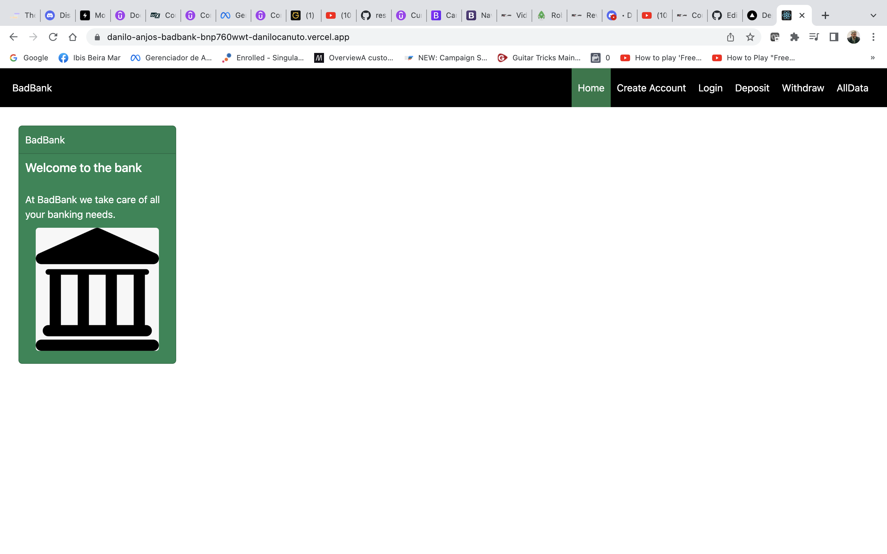

# [BadBank](https://danilocanuto.github.io/BadBank/)
<file src="index.html"/>

Project Title: BadBank

Description/Motivation:  Practice using State in React, adding validation, routing, context and modifying user interface. Also, practicing design improvements. 

Installation Guidelines: use npm start, which will run the app on port 3000.
Open [http://localhost:3000].

Screenshots: 

Technology used: The objective was to create a banking website with React and deploy it to the cloud(Vercel). The site's functionality was put together through the use of Routing, Context, Use State, Hooks, Bootstrap, React Toastify, etc...  

Future Improvements: To connect the front end app to a back end data base and launch a full stack app.

Licenced by MIT 'Full Stack Development with MERN program for educational purposes only.
